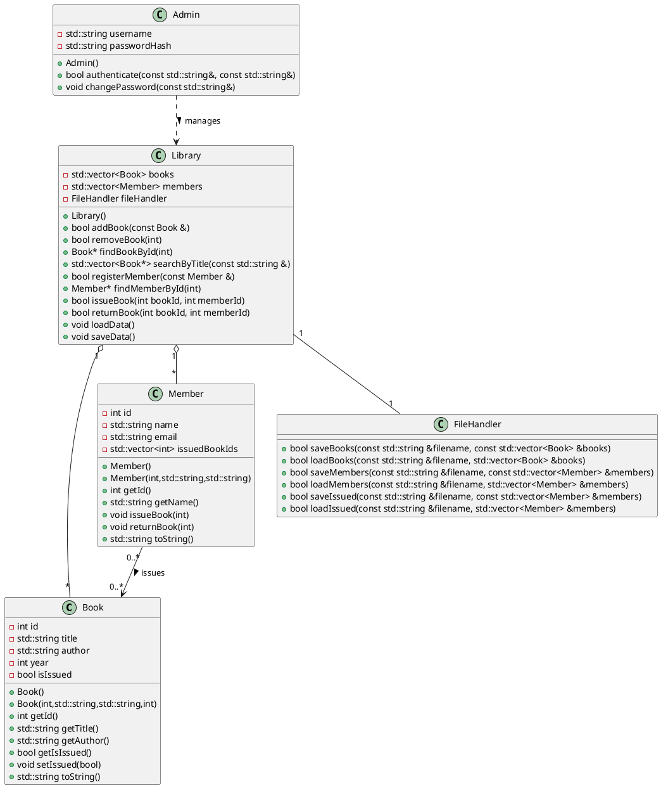

# First-One
Online Library Management System

# UML (PlantUML + ASCII)

### PlantUML class diagram (copy to `diagram.puml` and render with PlantUML)



### Quick ASCII overview

```
[Admin]  - manages -> [Library]
[Library] - contains -> [Book]*
[Library] - contains -> [Member]*
[Member] - issues -> [Book]
[Library] - persists via -> [FileHandler]
```

---

# CMakeLists.txt (drop in repo root)

```cmake
cmake_minimum_required(VERSION 3.10)
project(OnlineLibraryCPP VERSION 1.0 LANGUAGES CXX)

set(CMAKE_CXX_STANDARD 17)
set(CMAKE_CXX_STANDARD_REQUIRED ON)
set(SRCS
    src/main.cpp
    src/Book.cpp
    src/Member.cpp
    src/Library.cpp
    src/Admin.cpp
    src/FileHandler.cpp
)

add_executable(library ${SRCS})
target_include_directories(library PRIVATE ${CMAKE_SOURCE_DIR}/include)

# Optionally add install target
install(TARGETS library DESTINATION bin)
```

---

# Class design — headers & skeletons

I give headers with Doxygen-style comments (helps with your Doxygen request). Implementations are skeletons you can expand.

### include/Book.h

```cpp
#pragma once
#include <string>

/**
 * @brief Represents a book in the library
 */
class Book {
private:
    int id;
    std::string title;
    std::string author;
    int year;
    bool isIssued;

public:
    Book();
    Book(int id, const std::string &title, const std::string &author, int year);

    int getId() const;
    std::string getTitle() const;
    std::string getAuthor() const;
    int getYear() const;
    bool getIsIssued() const;

    void setIssued(bool issued);
    std::string toString() const;
};
```

### src/Book.cpp

```cpp
#include "Book.h"
#include <sstream>

Book::Book() : id(0), title(""), author(""), year(0), isIssued(false) {}
Book::Book(int id, const std::string &title, const std::string &author, int year)
    : id(id), title(title), author(author), year(year), isIssued(false) {}

int Book::getId() const { return id; }
std::string Book::getTitle() const { return title; }
std::string Book::getAuthor() const { return author; }
int Book::getYear() const { return year; }
bool Book::getIsIssued() const { return isIssued; }
void Book::setIssued(bool issued) { isIssued = issued; }

std::string Book::toString() const {
    std::ostringstream oss;
    oss << id << " | " << title << " | " << author << " | " << year << " | "
        << (isIssued ? "Issued" : "Available");
    return oss.str();
}
```

---

### include/Member.h

```cpp
#pragma once
#include <string>
#include <vector>

/**
 * @brief Library member
 */
class Member {
private:
    int id;
    std::string name;
    std::string email;
    std::vector<int> issuedBookIds;

public:
    Member();
    Member(int id, const std::string &name, const std::string &email);

    int getId() const;
    std::string getName() const;
    std::string getEmail() const;

    void issueBook(int bookId);
    void returnBook(int bookId);
    const std::vector<int>& getIssuedBookIds() const;
    std::string toString() const;
};
```

### src/Member.cpp

```cpp
#include "Member.h"
#include <algorithm>
#include <sstream>

Member::Member() : id(0), name(""), email("") {}
Member::Member(int id, const std::string &name, const std::string &email)
    : id(id), name(name), email(email) {}

int Member::getId() const { return id; }
std::string Member::getName() const { return name; }
std::string Member::getEmail() const { return email; }

void Member::issueBook(int bookId) {
    if(std::find(issuedBookIds.begin(), issuedBookIds.end(), bookId) == issuedBookIds.end())
        issuedBookIds.push_back(bookId);
}

void Member::returnBook(int bookId) {
    issuedBookIds.erase(std::remove(issuedBookIds.begin(), issuedBookIds.end(), bookId), issuedBookIds.end());
}

const std::vector<int>& Member::getIssuedBookIds() const { return issuedBookIds; }

std::string Member::toString() const {
    std::ostringstream oss;
    oss << id << " | " << name << " | " << email << " | Issued: " << issuedBookIds.size();
    return oss.str();
}
```

---

### include/FileHandler.h

```cpp
#pragma once
#include <string>
#include <vector>
#include "Book.h"
#include "Member.h"

/**
 * @brief Handles saving and loading of data files
 */
class FileHandler {
public:
    bool saveBooks(const std::string &filename, const std::vector<Book> &books);
    bool loadBooks(const std::string &filename, std::vector<Book> &books);
    bool saveMembers(const std::string &filename, const std::vector<Member> &members);
    bool loadMembers(const std::string &filename, std::vector<Member> &members);
    bool saveIssued(const std::string &filename, const std::vector<Member> &members);
    bool loadIssued(const std::string &filename, std::vector<Member> &members);
};
```

### src/FileHandler.cpp

```cpp
#include "FileHandler.h"
#include <fstream>
#include <sstream>

bool FileHandler::saveBooks(const std::string &filename, const std::vector<Book> &books) {
    std::ofstream ofs(filename);
    if(!ofs) return false;
    for(const auto &b : books) {
        ofs << b.getId() << "|" << b.getTitle() << "|" << b.getAuthor() << "|" << b.getYear()
            << "|" << (b.getIsIssued() ? 1 : 0) << "\n";
    }
    return true;
}

bool FileHandler::loadBooks(const std::string &filename, std::vector<Book> &books) {
    std::ifstream ifs(filename);
    if(!ifs) return false;
    books.clear();
    std::string line;
    while(std::getline(ifs, line)) {
        if(line.empty()) continue;
        std::istringstream iss(line);
        std::string token;
        int id, year, issued;
        std::string title, author;
        std::getline(iss, token, '|'); id = std::stoi(token);
        std::getline(iss, title, '|');
        std::getline(iss, author, '|');
        std::getline(iss, token, '|'); year = std::stoi(token);
        std::getline(iss, token, '|'); issued = std::stoi(token);
        Book b(id, title, author, year);
        b.setIssued(issued != 0);
        books.push_back(b);
    }
    return true;
}

bool FileHandler::saveMembers(const std::string &filename, const std::vector<Member> &members) {
    std::ofstream ofs(filename);
    if(!ofs) return false;
    for(const auto &m : members) {
        ofs << m.getId() << "|" << m.getName() << "|" << m.getEmail() << "\n";
    }
    return true;
}

bool FileHandler::loadMembers(const std::string &filename, std::vector<Member> &members) {
    std::ifstream ifs(filename);
    if(!ifs) return false;
    members.clear();
    std::string line;
    while(std::getline(ifs, line)) {
        if(line.empty()) continue;
        std::istringstream iss(line);
        std::string token;
        int id;
        std::string name, email;
        std::getline(iss, token, '|'); id = std::stoi(token);
        std::getline(iss, name, '|');
        std::getline(iss, email, '|');
        members.emplace_back(id, name, email);
    }
    return true;
}

bool FileHandler::saveIssued(const std::string &filename, const std::vector<Member> &members) {
    std::ofstream ofs(filename);
    if(!ofs) return false;
    for(const auto &m : members) {
        ofs << m.getId();
        for(auto bid : m.getIssuedBookIds()) ofs << "|" << bid;
        ofs << "\n";
    }
    return true;
}

bool FileHandler::loadIssued(const std::string &filename, std::vector<Member> &members) {
    std::ifstream ifs(filename);
    if(!ifs) return false;
    std::string line;
    while(std::getline(ifs, line)) {
        if(line.empty()) continue;
        std::istringstream iss(line);
        std::string token;
        std::getline(iss, token, '|');
        int memberId = std::stoi(token);
        // find member
        for(auto &m : members) {
            if(m.getId() == memberId) {
                while(std::getline(iss, token, '|')) {
                    m.issueBook(std::stoi(token));
                }
                break;
            }
        }
    }
    return true;
}
```

---

### include/Library.h

```cpp
#pragma once
#include <vector>
#include "Book.h"
#include "Member.h"
#include "FileHandler.h"

/**
 * @brief Manages collections and business logic
 */
class Library {
private:
    std::vector<Book> books;
    std::vector<Member> members;
    FileHandler fileHandler;

public:
    Library();
    bool addBook(const Book &book);
    bool removeBook(int bookId);
    Book* findBookById(int bookId);
    std::vector<Book*> searchByTitle(const std::string &title);

    bool registerMember(const Member &member);
    Member* findMemberById(int memberId);

    bool issueBook(int bookId, int memberId);
    bool returnBook(int bookId, int memberId);

    void loadData();
    void saveData();
};
```

### src/Library.cpp

```cpp
#include "Library.h"
#include <algorithm>

Library::Library() {}

bool Library::addBook(const Book &book) {
    if(findBookById(book.getId()) != nullptr) return false;
    books.push_back(book);
    return true;
}

bool Library::removeBook(int bookId) {
    auto it = std::remove_if(books.begin(), books.end(), [&](const Book &b){ return b.getId() == bookId; });
    if(it == books.end()) return false;
    books.erase(it, books.end());
    return true;
}

Book* Library::findBookById(int bookId) {
    for(auto &b : books) if(b.getId() == bookId) return &b;
    return nullptr;
}

std::vector<Book*> Library::searchByTitle(const std::string &title) {
    std::vector<Book*> res;
    for(auto &b : books) if(b.getTitle().find(title) != std::string::npos) res.push_back(&b);
    return res;
}

bool Library::registerMember(const Member &member) {
    if(findMemberById(member.getId()) != nullptr) return false;
    members.push_back(member);
    return true;
}

Member* Library::findMemberById(int memberId) {
    for(auto &m : members) if(m.getId() == memberId) return &m;
    return nullptr;
}

bool Library::issueBook(int bookId, int memberId) {
    Book* b = findBookById(bookId);
    Member* m = findMemberById(memberId);
    if(!b || !m) return false;
    if(b->getIsIssued()) return false;
    b->setIssued(true);
    m->issueBook(bookId);
    return true;
}

bool Library::returnBook(int bookId, int memberId) {
    Book* b = findBookById(bookId);
    Member* m = findMemberById(memberId);
    if(!b || !m) return false;
    b->setIssued(false);
    m->returnBook(bookId);
    return true;
}

void Library::loadData() {
    fileHandler.loadBooks("data/books.dat", books);
    fileHandler.loadMembers("data/members.dat", members);
    fileHandler.loadIssued("data/issued.dat", members);
}

void Library::saveData() {
    fileHandler.saveBooks("data/books.dat", books);
    fileHandler.saveMembers("data/members.dat", members);
    fileHandler.saveIssued("data/issued.dat", members);
}
```

---

### include/Admin.h

```cpp
#pragma once
#include <string>

/**
 * @brief Admin user for the system
 */
class Admin {
private:
    std::string username;
    std::string passwordHash;
public:
    Admin();
    Admin(const std::string &username, const std::string &passwordHash);
    bool authenticate(const std::string &username, const std::string &password) const;
    void changePassword(const std::string &newPassword);
    std::string getUsername() const;
};
```

### src/Admin.cpp

```cpp
#include "Admin.h"
#include <functional>

// Simple placeholder hash (for demo only). Replace with secure hash (bcrypt/sha) in real app.
static std::size_t simpleHash(const std::string &s) {
    return std::hash<std::string>{}(s);
}

Admin::Admin() : username("admin"), passwordHash(std::to_string(simpleHash("admin"))) {}
Admin::Admin(const std::string &username, const std::string &passwordHash)
    : username(username), passwordHash(passwordHash) {}

bool Admin::authenticate(const std::string &user, const std::string &password) const {
    return user == username && passwordHash == std::to_string(simpleHash(password));
}

void Admin::changePassword(const std::string &newPassword) {
    passwordHash = std::to_string(simpleHash(newPassword));
}

std::string Admin::getUsername() const { return username; }
```

---

# File handling modules (explanation + tips)

* `FileHandler` shown above uses simple pipe-delimited text files. Pros: human-readable, easy to parse. Cons: not transactional, no schema.
* If you want binary files, switch `ofstream`/`ifstream` to binary mode and write/read POD structs carefully (watch endianness).
* For data integrity, consider:

  * Temp+rename pattern: write to `books.tmp` then `std::rename` to `books.dat`.
  * Backups: rotate `books.bak`.
  * Locking: use filesystem locks if multi-process access needed.

---

# Doxygen documentation template & comments

### Minimal `Doxyfile` (create using `doxygen -g` then replace)

```
# Doxygen configuration file (minimal)
PROJECT_NAME           = "Online Library Management System"
OUTPUT_DIRECTORY       = docs
INPUT                  = include src
FILE_PATTERNS          = *.h *.hpp *.cpp
RECURSIVE              = YES
GENERATE_LATEX         = NO
GENERATE_HTML          = YES
EXTRACT_ALL            = YES
OPTIMIZE_OUTPUT_FOR_C  = NO
QUIET                  = NO
```

### Example Doxygen comments (already added to headers above)

I included `@brief` and basic descriptions in headers — Doxygen will pick those up. Add `@param` and `@return` to functions as you expand them.

---

# Logo / Banner for GitHub repo

### ASCII banner (put in `assets/banner.txt` or top of README)

```
  _      _ _                          _     _ _   _ _           
 | |    (_) |                        | |   | | | (_) |          
 | |     _| |__  _ __ ___   ___ _ __ | |__ | | |_ _| | ___  ___ 
 | |    | | '_ \| '_ ` _ \ / _ \ '_ \| '_ \| | __| | |/ _ \/ __|
 | |____| | |_) | | | | | |  __/ | | | |_) | | |_| | |  __/\__ \
 |______|_|_.__/|_| |_| |_|\___|_| |_|_.__/|_|\__|_|_|\___||___/
                                                                
       C++ Online Library Management System - Console Edition
```

### Suggested PNG/SVG banner (quick steps)

1. Use the ASCII banner as basis or create a simple SVG:

   * Title text, small book icon, and background color.
2. Place file as `assets/banner.png` or `assets/banner.svg`.
3. Add to README as:

```markdown

```

If you want, I can generate an SVG string you can paste into a file — say the colors and style you want and I’ll produce it.

---

# Doxygen usage

* Install: `sudo apt install doxygen` or get from doxygen.org.
* Generate: `doxygen Doxyfile`
* Open `docs/html/index.html`.

---

# Quick checklist: where to put files

```
/LibraryManagementSystem
│── include/        # all .h
│── src/            # all .cpp
│── data/           # books.dat, members.dat, issued.dat (create empty)
│── assets/         # banner.png or banner.txt
│── tests/          # optional
│── CMakeLists.txt
│── Doxyfile
│── diagram.puml
